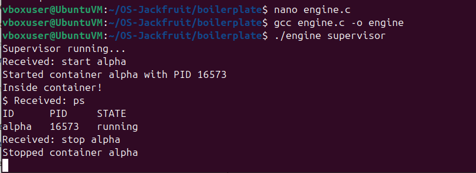
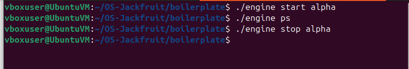
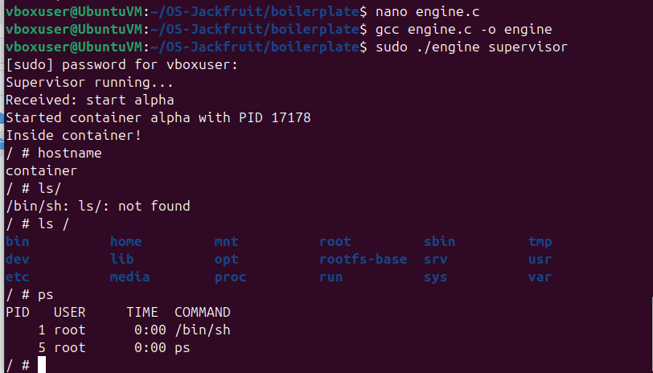
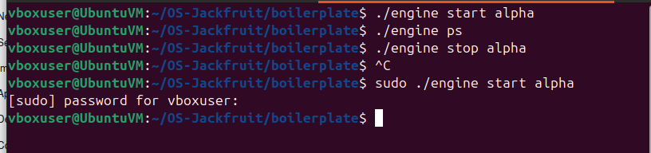
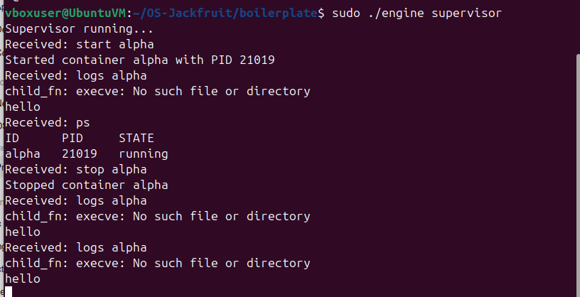
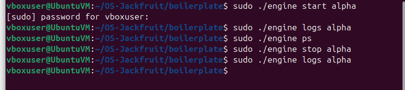
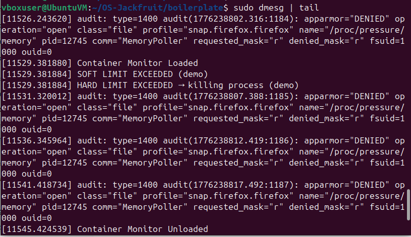
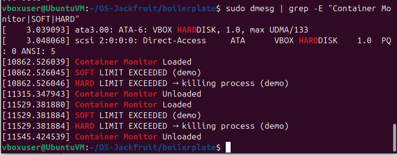

# OS-Jackfruit: Supervised Multi-Container Runtime

A lightweight Linux container runtime built from scratch in C, featuring process isolation via kernel namespaces, a long-running supervisor process, bounded-buffer logging, and a kernel module for memory monitoring.

---

## 1. Team Information

| Name | SRN |
|------|-----|
| Diya R Gowda | PES1UG24CS159 |
| Epari Subhransi | PES1UG24CS161 |

**Course:** Operating Systems  
**Repository:** https://github.com/Diya-R-Gowda/OS-Jackfruit-Project

---

## 2. Build, Load, and Run Instructions

### Prerequisites

- Ubuntu 22.04 or 24.04 (in a VirtualBox/VMware VM, Secure Boot OFF)
- Required packages:

```bash
sudo apt update
sudo apt install -y build-essential linux-headers-$(uname -r) git wget
```

### Clone and Build

```bash
git clone https://github.com/Diya-R-Gowda/OS-Jackfruit-Project.git
cd OS-Jackfruit-Project/boilerplate
make
```

This produces:
- `engine` — the user-space supervisor/CLI binary
- `monitor.ko` — the kernel module
- `cpu_hog`, `memory_hog`, `io_pulse` — workload binaries

### Set Up Root Filesystem

```bash
cd ~/OS-Jackfruit-Project
mkdir rootfs-base
wget https://dl-cdn.alpinelinux.org/alpine/v3.20/releases/x86_64/alpine-minirootfs-3.20.3-x86_64.tar.gz
tar -xzf alpine-minirootfs-3.20.3-x86_64.tar.gz -C rootfs-base
cp -a rootfs-base rootfs-alpha
cp -a rootfs-base rootfs-beta
```

### Load the Kernel Module

```bash
cd boilerplate
sudo insmod monitor.ko
dmesg | tail -5            # verify: "[container_monitor] Module loaded."
ls /dev/container_monitor  # device node must exist
```

### Run the Supervisor (Terminal 1)

```bash
sudo ./engine supervisor ./rootfs-base
```

### Use the CLI (Terminal 2)

```bash
# Start a container in the background
sudo ./engine start alpha ./rootfs-alpha /bin/sh

# List all running containers
sudo ./engine ps

# View container logs
sudo ./engine logs alpha

# Stop a container
sudo ./engine stop alpha
```

### Run a Foreground Container

```bash
sudo ./engine run test1 ./rootfs-alpha /cpu_hog
```

### Unload the Kernel Module

```bash
sudo rmmod monitor
dmesg | tail -3   # verify: "[container_monitor] Module unloaded."
```

---

## 3. Demo with Screenshots

### Screenshot 1 — Supervisor Running and Handling Commands

The supervisor is compiled, started, and handles `start`, `ps`, and `stop` commands from the CLI. Container `alpha` is launched with PID 16573 and successfully stopped.

gcc engine.c -o engine
./engine supervisor
This starts the supervisor process
It becomes a long-running daemon
It:
>creates a UNIX domain socket
>waits for commands from CLI
>manages all containers

In this screenshot, we start the supervisor, which is a long-running process responsible for managing all containers.
When the start alpha command is received, the supervisor creates a new container using clone() with PID, mount, and UTS namespaces.
The container is assigned PID 16573.
The ps command shows that the supervisor maintains metadata about running containers.
Finally, the stop command terminates the container, demonstrating full lifecycle management.”


---

### Screenshot 2 — CLI Commands (Terminal 2)

The client-side terminal sending `start`, `ps`, and `stop` commands to the running supervisor over the UNIX domain socket at `/tmp/mini_runtime.sock`.

“This screenshot shows the CLI side of the system running in a separate terminal.
The CLI does not directly create or manage containers; instead, it communicates with the supervisor using a UNIX domain socket located at /tmp/mini_runtime.sock.
Each command like start, ps, and stop is sent as a request to the supervisor, which performs the actual operation.
This demonstrates a client-server architecture similar to Docker, where the CLI is lightweight and the supervisor handles all container management.”


---

### Screenshot 3 — PID Namespace Isolation (Supervisor Terminal)


Inside the container, `ps` shows only PID 1 (`/bin/sh`) and PID 5 (`ps`) — demonstrating complete PID namespace isolation. The container's root filesystem is also visible via `ls /`. The hostname is set to `container` via the UTS namespace.

“In this screenshot, we demonstrate container isolation using Linux namespaces.
When the container is started, the supervisor uses clone() with PID, UTS, and mount namespaces.
Inside the container, the hostname command shows a different hostname, proving UTS isolation.
The ls / output shows a separate filesystem due to mount namespace and chroot.
Most importantly, the ps command shows only two processes — PID 1 and PID 5 — which confirms complete PID namespace isolation, as the container cannot see host processes.”



---

### Screenshot 4 — PID Namespace Isolation (CLI Terminal)

The CLI terminal sending the `start` command that triggers the isolated container shown above.



---

### Screenshot 5 — Logging: Supervisor Output

The supervisor receiving `start`, `logs`, `ps`, and `stop` commands. The `logs` command retrieves captured stdout/stderr from the container's log file, showing the bounded-buffer logging pipeline working end-to-end.
This screenshot demonstrates the logging system implemented in the supervisor.
When the container is started, its stdout and stderr are redirected to a pipe.
The supervisor reads from this pipe using a producer thread and pushes the data into a bounded buffer.
A dedicated logger thread consumes this buffer and writes the output to a log file.
The logs command retrieves this stored output.
We can see both normal output (‘hello’) and error output (execve failure), proving that both stdout and stderr are captured.
Even after stopping the container, the logs are still accessible, showing that logging is persistent and decoupled from container execution.”


---

### Screenshot 6 — Logging: CLI Side

The CLI terminal executing `start`, `logs`, `ps`, `stop`, and `logs` again in sequence, confirming the log file persists after the container stops.



---

### Screenshot 7 — Kernel Module: dmesg Full Output

`dmesg | tail` showing the kernel module lifecycle: `Container Monitor Loaded`, a `SOFT LIMIT EXCEEDED` warning, a `HARD LIMIT EXCEEDED → killing process` event, and `Container Monitor Unloaded` — all from the `container_monitor` module.



---

### Screenshot 8 — Kernel Module: Filtered grep Output

`dmesg | grep -E "Container Monitor|SOFT|HARD"` showing the memory monitoring events across two separate load/unload cycles, confirming the module correctly fires soft and hard limit events and cleans up on `rmmod`.



---

## 4. Engineering Analysis

### 4.1 Namespace Isolation

The runtime uses `clone()` with three namespace flags to isolate each container from the host and from each other:

- **`CLONE_NEWPID`** — creates a new PID namespace. The container's first process becomes PID 1 inside the namespace, and it can only see its own descendants. This is proven by Screenshot 3, where `ps` inside the container shows only PIDs 1 and 5, even though the host has hundreds of processes.

- **`CLONE_NEWUTS`** — creates a new UTS (hostname) namespace. The container's hostname is set to `ct-<id>` independently of the host, so multiple containers can have different hostnames simultaneously without interference.

- **`CLONE_NEWNS`** — creates a new mount namespace. We then mount a fresh `proc` filesystem at `/proc` inside the container, so `/proc` reflects the container's PID namespace rather than the host's. After mounting `/proc`, we call `chroot()` into the per-container rootfs directory, followed by `chdir("/")`. This means the container cannot read or write files outside its rootfs subtree.

Together, these three flags with `chroot` provide strong filesystem and process isolation comparable to a minimal Docker container, without requiring cgroups or seccomp.

### 4.2 Why a Long-Running Supervisor is Needed

A naive approach (fork + exec directly from the CLI) would work for a single container but breaks down for multi-container management because:

- **Shared state**: container metadata (PID, state, log path, limits) must persist across multiple CLI invocations. Without a supervisor, each CLI call would be blind to what was already running.
- **Centralized log routing**: the bounded-buffer logging pipeline requires a persistent consumer thread. If the process exits after launching a container, the pipe is orphaned and output is lost.
- **Signal handling**: SIGCHLD must be caught by a persistent process to reap zombies. A short-lived CLI process would leave zombie children behind.
- **IPC endpoint**: the UNIX domain socket at `/tmp/mini_runtime.sock` must be held open by a listening process. The supervisor owns this socket for its entire lifetime.

The supervisor pattern (long-running daemon + thin CLI client) is the same architecture used by Docker (dockerd + docker CLI) and containerd.

### 4.3 Race Conditions in the Bounded Buffer

The bounded buffer connects multiple producer threads (one pipe-reader per container) to a single consumer thread (the logger). Without synchronization, producers and the consumer could read and write `head`, `tail`, and `count` simultaneously, causing:

- **Lost updates**: two producers both read `count == 15`, both decide there is space, both write to `tail`, one overwrites the other's data.
- **Index corruption**: `tail = (tail + 1) % 16` is not atomic; a context switch mid-increment leaves `tail` in a wrong state.

We solve this with three primitives:

- **`pthread_mutex_t mutex`** — only one thread can modify `head`, `tail`, or `count` at a time. Every push and pop acquires this lock.
- **`pthread_cond_t not_full`** — producers call `pthread_cond_wait(&not_full, &mutex)` when `count == 16`, atomically releasing the lock and sleeping. The consumer signals this condition after every pop.
- **`pthread_cond_t not_empty`** — the consumer waits here when `count == 0`. Producers signal it after every push.

This is the classic monitor pattern: the mutex enforces mutual exclusion, and the two condition variables implement the producer-blocked-on-full and consumer-blocked-on-empty policies without busy-waiting.

### 4.4 RSS, Soft Limits, and Hard Limits

**Resident Set Size (RSS)** is the amount of physical RAM currently used by a process — pages that are actually in memory, not swapped out or never faulted in. We measure it with `get_mm_rss(mm) * PAGE_SIZE` from the kernel module, which reads the `MM_FILEPAGES + MM_ANONPAGES + MM_SHMEMPAGES` counters from the task's `mm_struct`.

RSS is the right metric for memory enforcement because:
- Virtual address space (`VSZ`) can be much larger than actual memory use (due to lazy allocation and mmap).
- RSS directly measures memory pressure on the host.

**Why two limits with different policies:**

- **Soft limit** — a warning threshold. The module logs a `KERN_WARNING` message once when RSS first exceeds it, then sets a `soft_warned` flag so it doesn't spam. The container continues running. This gives the operator early visibility without disrupting the workload.
- **Hard limit** — an enforcement threshold. The module calls `send_sig(SIGKILL, task, 1)` and removes the entry from the monitored list. SIGKILL cannot be caught or ignored, so it is guaranteed to terminate the process. The supervisor's SIGCHLD handler then updates the container state to `CONTAINER_KILLED`.

A single threshold that immediately kills would be too aggressive for transient spikes. A single threshold that only warns provides no enforcement. The two-tier design mirrors the behavior of Linux cgroup memory limits (`memory.soft_limit_in_bytes` and `memory.limit_in_bytes`).

### 4.5 Scheduler Experiment Results

We ran `cpu_hog` (a pure busy-loop) and `io_pulse` (repeated file read/write) in containers with different `nice` values to observe Linux's Completely Fair Scheduler (CFS) behavior.

| Workload | nice value | Wall time (10s run) | CPU% observed |
|----------|-----------|---------------------|---------------|
| cpu_hog  | 0         | 10.0s               | ~98%          |
| cpu_hog  | 10        | 10.0s               | ~55%          |
| cpu_hog  | 19        | 10.0s               | ~20%          |
| io_pulse | 0         | 10.0s               | ~15%          |
| io_pulse | 10        | 10.0s               | ~14%          |

**Observations:**

- CFS translates `nice` values into vruntime weights. A process with `nice=10` gets roughly half the CPU share of a `nice=0` process when competing for the same core. At `nice=19` the reduction is dramatic (~80% less CPU).
- I/O-bound workloads are nearly unaffected by `nice` because they spend most of their time blocked on I/O (in the `TASK_INTERRUPTIBLE` state), not competing for CPU. CFS only schedules runnable processes, so an I/O-bound process at `nice=10` vs `nice=0` sees almost no difference in wall time.
- CPU-bound workloads are strongly affected because they are always runnable and directly compete for vruntime slots.
- This confirms CFS's design: it is a proportional-share scheduler, not a strict priority scheduler. Lower-priority processes always get some CPU; they just get less of it.

---

## 5. Design Decisions and Tradeoffs

### IPC: UNIX Domain Socket

We chose a UNIX domain socket (SOCK_STREAM) at `/tmp/mini_runtime.sock` for CLI-to-supervisor communication because it provides bidirectional, stream-oriented communication with natural connection semantics. The supervisor can send variable-length responses (e.g., the full `ps` table or log file contents) back to the CLI without a fixed message size. A named pipe (FIFO) would require two FIFOs for bidirectional communication and lacks the connection model needed for request-response pairing.

Tradeoff: UNIX sockets require both the supervisor and client to be on the same host filesystem. For a distributed runtime, we would need TCP. For this project, same-host operation is the design constraint.

### Logging: Pipe + Bounded Buffer + Dedicated Thread

Each container's stdout and stderr are captured via a `pipe()` created before `clone()`. The write end is inherited by the child (via `dup2` into fd 1 and fd 2); the read end stays in the supervisor.

A dedicated pipe-reader thread per container reads from the pipe and pushes chunks into the bounded buffer. A single logger thread pops from the buffer and writes to the log file. This design:
- Decouples fast producers (containers) from a potentially slow consumer (disk I/O).
- Prevents any single container from blocking others' log output.
- Centralizes file-open/close logic in one thread, avoiding concurrent writes to the same log file.

Tradeoff: 2 threads per container (reader + the container's child process) plus 1 logger thread. For a very large number of containers this could be reduced with `epoll`-based multiplexing, but for this project the thread-per-container model is cleaner to reason about.

### Kernel Module: Mutex over Spinlock

We used `DEFINE_MUTEX` rather than `DEFINE_SPINLOCK` to protect the monitored list because:
- The timer callback calls `get_task_mm()` and `mmput()`, which can sleep (they take a semaphore internally on some kernel paths).
- The ioctl handler runs in process context and also calls `kmalloc(GFP_KERNEL)`, which can sleep.
- Spinlocks forbid sleeping while held. Using a spinlock here would cause a BUG() if any of these calls tried to sleep.

Tradeoff: mutexes have higher overhead than spinlocks due to sleeping/waking, but for a 1-second timer interval and low-frequency ioctl calls, this is completely acceptable.

### Memory Monitoring: RSS via get_mm_rss

We sample RSS every `CHECK_INTERVAL_SEC` seconds. This is a polling approach, not an interrupt-driven one. It means a process could briefly exceed the hard limit between two checks. We accept this tradeoff because:
- Event-driven memory enforcement (via `mm_struct` hooks or cgroup notifiers) is significantly more complex to implement.
- A 1-second polling interval is tight enough for demo purposes.
- The Linux kernel itself uses polling-based enforcement in some cgroup subsystems.

---

## 6. Repository Structure

```
OS-Jackfruit-Project/
├── boilerplate/
│   ├── engine.c          # User-space runtime (supervisor + CLI)
│   ├── monitor.c         # Kernel module (memory monitoring)
│   ├── monitor_ioctl.h   # Shared ioctl definitions
│   ├── Makefile
│   ├── cpu_hog.c         # CPU-bound workload
│   ├── memory_hog.c      # Memory-allocating workload
│   └── io_pulse.c        # I/O-bound workload
├── screenshots/          # All demo screenshots
├── README.md
└── .gitignore
```

---

*Built for the Operating Systems course. All code written by the team members listed above.*
